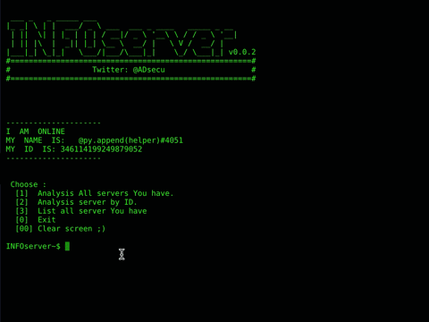

# Discord-infoserver
bot or tool or code , named as you want . Made for analysis server and you can output all inforamtion about server , who has administrator 
, manage server , manage role , hidden channels , top 10 roles , roles permissions ...etc **You do not need any permissions** and **You can use it as selfbot**

- output as HTML file . saved in bot or code folder. And there is example for output file [3193033456276864 -Example]
- **Recommend** : use Google Chrome to open HTML file.

`self_infoserver.py` for selfbot [user account] , `infoserver.py` for bot account.

## Screenshot


## Features
- server owner [members, bots].
- who has [administrator,ban_members,kick_members,manage_server,manage_roles,manage_channels,manage_messages].
- Top 10 roles and roles permissions.
- Hidden Text channels with channel ID.
- Muted members and roles in server , channels.
- Hidden voice channels with members.


## Requirements
- python 3.6.X
- pip

**modules :**
- discord.py 
`pip3 install discord.py` or for windows `py -m pip install -U discord.py`


## Token
open `infoserver.py` :
```
token = "Token Here"
```
replace token by your own(Line 10)


## Start the bot
**Note** : `infoserver.py`for bot token and `self_infoserver.py` for self account token.
 - **Linux and macOS :** `python3 infoserver.py` 
 - **Windows :** `py infoserver.py` or just double click [if support]
 
 

**How to :**
```
 Choose :
  [1]  Analysis All servers You have.
  [2]  Analysis server by ID.
  [3]  List all server You have
  [0]  Exit
  [00] Clear screen ;)
```
just type number on terminal !


 ## Who am i ?
 Ahmad A. Alsrehy
 
 Twitter : [@ADsecu](http://twitter.com/adsecu) 
 
